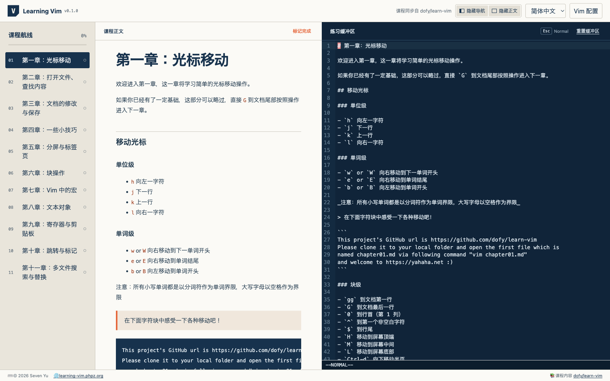

# Learning Vim

**Read the lesson. Put your hands on the keys. Learn Vim without leaving the page.**

[](https://github.com/dofy/learning-vim/actions/workflows/verify.yml)
[](https://learning-vim.phpz.org/)
[](https://learning-vim.phpz.org/)

Learning Vim turns the hands-on lessons from
[`dofy/learn-vim`](https://github.com/dofy/learn-vim) into an interactive web
course. The explanation stays beside a working Vim-style editor, so every
motion, edit, search, macro, text object, and register can move immediately from
something you read to something you do.

🌐 **Website:** [learning-vim.phpz.org](https://learning-vim.phpz.org/)



## Learn with both eyes and hands

Most Vim tutorials make you memorize commands in one window and practice them
somewhere else. Learning Vim keeps the whole loop in one focused workspace:

- 🧭 Follow all 11 chapters from a compact course map.
- 📖 Read the original lesson in English, Simplified Chinese, or Japanese.
- ⌨️ Practice directly on a copy of the lesson with Vim keybindings.
- 🎛️ Hide the course map or lesson and give the editor more room.
- 💾 Keep edited buffers, language, progress, and preferences on the device.
- 📴 Install the site as a PWA and keep the course available offline.
- ⚙️ Load a safe `.vimrc` subset for mappings and common editor options.

The layout is built for uninterrupted practice: the header and footer stay in
place while the course map, lesson, and editor scroll independently. On smaller
screens, the same workspace becomes a clean Read / Practice switcher.

## Course content stays independent

This website and the course are deliberately separate projects:

```text
dofy/learn-vim                   dofy/learning-vim
Markdown course  ── sync ─────▶ interactive static PWA
```

`learn-vim` remains a plain Markdown tutorial that can be cloned and opened in
Vim. `learning-vim` copies a versioned course snapshot during the build, checks
the three locale structures, and packages the content for static hosting and
offline use. The web app never becomes a second source of truth.

## Run it locally

Place both repositories next to each other:

```text
Seven/
├── learn-vim/
└── learning-vim/
```

Then start the web project:

```bash
pnpm install
pnpm dev
```

Open <http://localhost:5173/>. To use another content checkout:

```bash
LEARN_VIM_CONTENT_DIR=/path/to/learn-vim pnpm dev
```

Create and inspect the production build with:

```bash
pnpm build
pnpm preview
```

## What the MVP supports

The current editor uses CodeMirror 6 with `@replit/codemirror-vim`. It covers
the everyday Vim motions and editing workflow needed for the first usable
release. The `.vimrc` parser intentionally supports a safe subset:

- `set number`, `relativenumber`, `wrap`, and `tabstop`
- `map`, `noremap`, `nmap`, `nnoremap`, `imap`, `inoremap`, `vmap`, and their
  matching `unmap` commands
- `let mapleader = "..."`

This is not yet a complete Vim runtime. Real buffers and windows, external shell
commands, and arbitrary plugins belong to the next engine rather than being
poorly imitated in the MVP.

## Next on the voyage

- A replaceable real Vim / WebAssembly engine
- Exercise checkpoints based on editor state
- Richer file and buffer navigation
- Optional cross-device progress sync
- Automated upstream content update pull requests

Course content comes from [`dofy/learn-vim`](https://github.com/dofy/learn-vim).
The interactive web application is maintained by
[Seven Yu](https://github.com/dofy).
